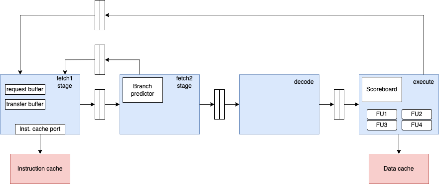

# Modeling CPU with GEM5


## CPU models in GEM5 

- There are four main CPU models in GEM5:
    - **SimpleCPU**
    - **BaseKVM CPU**
    - **Derive03CPU**
    - **MinorCPU**
  

### Simple CPU models 

- The **SimpleCPU** is a purely functional, in-order model that is suited for cases where a detailed model is not necessary. This can include warm-up periods, client systems that are driving a host, or just testing to make sure a program works.

- **BaseSimpleCPU** class that is used the model of core elements of CPU:
  - common stats for all CPU models 
  - models interrupt handling, fetch request, pre-execution, execution, post-execution stages as well as moving to next instruction 
  - definies execution context for CPU 
  - Note: the class is not used directly, but it is inherited by other CPU models.

- **AtomicSimpleCPU** is a version of SimpleCPU that uses atomic memory access.
  - atomic memory access: memory operations are not broken down into smaller operations. They are not interrupted by other memory operations.

  
- **TimingSimpleCPU** is a version of SimpleCPU that uses timing memory access.
  - timing memory access: stalls on cache accesses and waits for the memory system to respond prior to proceeding.


### BaseKVM CPU model

- Uses the Kernel-based Virtual Machine (KVM) to run full-system simulations. This model is used to run full-system simulations on x86 hosts.

- Note the host and BaseKVM CPU model need to have the same ISA. Therefore, we have two flavors of BaseKVM CPU model:
  - **X86KvmCPU**
  - **ArmKvmCPU**


### Minor CPU model

- Models simple in-order processor with 4 stage pipeline 



**Fetch1** is responsible for obtaining instruction bytes from memory. It generates the program counter (PC), performs address translation through the instruction TLB, and sends instruction fetch requests to the instruction cache. When cache lines return, they are forwarded to the next stage. Fetch1 also reacts to branch redirections coming from later stages and discards already-fetched instructions that belong to the wrong execution path.

**Fetch2** receives cache lines from Fetch1 and converts them into individual instructions. It extracts and packages instructions into vectors that can be processed by the pipeline and performs branch prediction to guess the future control flow. If a branch is predicted as taken, Fetch2 redirects the fetch stream and ensures that incorrect instructions are flushed early.

**Decode** translates ISA instructions into the processor’s internal micro-operations (µops). Some instructions may expand into multiple µops, which are then grouped and prepared for execution. This stage mainly performs instruction interpretation and formatting so the Execute stage can process operations efficiently.

**Execute** performs the actual computation and completes instruction processing. It issues operations to functional units, handles multi-cycle execution, manages memory accesses through the load/store queue, resolves branch outcomes, and commits instructions in program order. The results of execution, including branch feedback, are sent back to earlier stages to maintain correct pipeline behavior.


### CPU interaction with rest of the system

* **Interaction with memory:**
  The MinorCPU communicates with the memory system through separate **instruction and data ports**, reflecting a Harvard-style organization. The instruction port is used by the fetch stages to request cache lines from the instruction cache, while the data port is used by the Execute stage to perform load and store operations through the data cache and the load/store queue. These ports allow the CPU to send memory requests, receive responses, and model realistic memory latency, cache behavior, and back-pressure from the memory hierarchy.

* **Interaction with the ISA subsystem:**
  MinorCPU relies on the gem5 **ISA subsystem** to interpret and execute instructions according to the selected architecture (e.g., RISC-V, ARM, x86). The CPU uses an **execution context** that contains architectural state such as registers, program counter, and condition flags. Through this interface, decoded instructions are translated into micro-operations, register reads and writes are performed, and exceptions or faults can be generated in a way that is consistent with the chosen ISA.

* **Interaction with the rest of the system:**
  MinorCPU integrates with the wider gem5 simulation through a **thread context**, which represents the architectural view of a running software thread. The thread context enables communication with the operating system, interrupt handling, context switching, and debugging facilities. This interface allows the CPU to participate in full-system simulations where multiple components—such as devices, kernels, and other CPUs—interact as part of a complete computer system.

## Modeling MinorCPU in gem5

We can model the MinorCPU in gem5 with configuration script, written in python. The configuration parameters can be divided into: 

### Pipeline parameters

These parameters define the structure and behavior of the pipeline stages, such as fetch width, decode width, issue width, and commit width. They also include parameters for branch prediction, such as the size of the branch predictor and the number of entries in the branch target buffer.

| Setting | Meaning |
|---------|---------|
| `executeInputWidth` | Number of instructions that can be sent to the execute stage per cycle |
| `executeInputBufferSize` | Number of instructions that can be buffered between the issue and execute stages |
| `decodeInputBufferSize` | Number of instructions that can be buffered between the decode and issue stages |
| `executeIssueLimit` | Maximum number of instructions that can be dispatched per cycle |
| `executeMemoryIssueLimit` | Maximum number of memory instructions that can be dispatched per cycle |
| `decodeToExecuteForwardDelay` | Pipeline delay between decode and execute stages (in cycles) |
| `enableIdling` | Whether the CPU can enter idle states when no instructions are available |
| `fetch1LineWidth` | Instruction fetch width in bytes |

### Execution unit parameters 

In MinorCPU, the Execute stage uses a **functional unit pool (FUPool)** that defines which execution units exist in the processor and which instructions they can execute. To create a custom configuration, we extend the MinorCPU Python configuration  by defining new functional units, grouping them into a pool, and attaching that pool to the CPU. This allows us to experiment with execution latency, throughput, and supported instruction classes.

``` python
class MinorFU(SimObject):
    type = "MinorFU"
    cxx_header = "cpu/minor/func_unit.hh"
    cxx_class = "gem5::MinorFU"

    opClasses = Param.MinorOpClassSet(
        MinorOpClassSet(),
        "type of operations allowed on this functional unit",
    )
    opLat = Param.Cycles(1, "latency in cycles")
    issueLat = Param.Cycles(
        1, "cycles until another instruction can be issued"
    )
    timings = VectorParam.MinorFUTiming([], "extra decoding rules")

    cantForwardFromFUIndices = VectorParam.Unsigned(
        [],
        "list of FU indices from which this FU can't receive and early"
        " (forwarded) result",
    )
```

A new functional unit is created by subclassing `MinorFU`. In this class we specify the supported instruction types using `opClasses`, which map the unit to ISA operation classes such as integer, floating-point, or memory operations. We can also provide timing information with `MinorFUTiming`, and define key parameters such as `opLat` (execution latency in cycles) and `issueLat` (how frequently the unit can accept new instructions). For example, a custom floating-point ALU can be defined to support operations like `FloatAdd`, `FloatCmp`, and `FloatCvt`, with a longer latency to model slower arithmetic.

``` python
class MinorCustomFloatALU(MinorFU):
    opClasses = minorMakeOpClassSet(
        [
            "FloatAdd",
            "FloatCmp",
            "FloatCvt",
            "FloatMisc"
        ]
    )

    timings = [MinorFUTiming(description="FloatALUCustom", srcRegsRelativeLats=[2])]
    opLat = 6
```

After defining individual units, they are combined into a custom pool by subclassing `MinorFUPool`. The pool contains a list of functional unit instances that represent the hardware resources available in the Execute stage. Typically, the pool mixes default integer and memory units with newly created custom units. By changing this list, we directly control the number and types of execution resources available in the simulated CPU.
``` python
class MyCustomFUPool(MinorFUPool):
            funcUnits = [
                MinorDefaultIntFU(), # default integer ALU
                MinorDefaultIntMulFU(), # default integer multiplier
                MinorDefaultIntDivFU(),  # default integer divider
                MinorCustomFloatALU(), # custom floating-point ALU
                MinorCustomFloatMult(), # custom floating-point multiplier
                MinorCustomFloatDiv(),  # custom floating-point divider
                MinorDefaultMemFU(), # default memory access FU
            ]
```

Finally, the custom pool is attached to the CPU by assigning it to the `executeFuncUnits` parameter in the MinorCPU configuration. Once connected, individual units inside the pool can be tuned by modifying parameters such as `opLat` and `issueLat`. This configuration step determines how quickly instructions execute and how often new operations can be issued, enabling experiments that explore the impact of microarchitectural design choices on performance.

``` python
 # - Memory access FU (address calculation and load/store)
self.executeFuncUnits = MyCustomFUPool()

# The parameter opLat is the latency of the functional unit, i.e., the number of cycles it takes for the
self.executeFuncUnits.funcUnits[0].opLat = INTEGER_ALU_LATENCY
self.executeFuncUnits.funcUnits[1].opLat = INTEGER_MUL_LATENCY
self.executeFuncUnits.funcUnits[2].opLat = INTEGER_DIV_LATENCY
self.executeFuncUnits.funcUnits[3].opLat = FLOAT_ALU_LATENCY
self.executeFuncUnits.funcUnits[4].opLat = FLOAT_MUL_LATENCY
self.executeFuncUnits.funcUnits[5].opLat = FLOAT_DIV_LATENCY
self.executeFuncUnits.funcUnits[6].opLat = INTEGER_ALU_LATENCY # Memory access latency is the same as integer ALU latency
# The parameter issueLat controls the issue latency of the functional unit, i.e., the number of cycles
# until another instruction can be issued to the functional unit after an instruction has already been issued.
self.executeFuncUnits.funcUnits[0].issueLat = INTEGER_ALU_ISSUE_LATENCY
self.executeFuncUnits.funcUnits[1].issueLat = INTEGER_MUL_ISSUE_LATENCY
self.executeFuncUnits.funcUnits[2].issueLat = INTEGER_DIV_ISSUE_LATENCY
self.executeFuncUnits.funcUnits[3].issueLat = FLOAT_ALU_ISSUE_LATENCY
self.executeFuncUnits.funcUnits[4].issueLat = FLOAT_MUL_ISSUE_LATENCY
self.executeFuncUnits.funcUnits[5].issueLat = FLOAT_DIV_ISSUE_LATENCY
self.executeFuncUnits.funcUnits[6].issueLat = INTEGER_ALU_ISSUE_LATENCY # Memory access issue latency is the same as integer ALU issue latency
```

## Workload 

In the provided code, we have a simple matrix multiplication benchmark that multiplies two 25x25 matrices filled with integers. The benchmark has following snippet:

``` c
    #ifdef GEM5
        m5_reset_stats(0, 0);
    #endif


    for(int c=0; c<size; c++)
    {
        for(int d=0; d<size; d++)
        {
            int sum = 0;
            for(int k=0; k<size; k++)
            {
                sum += first[c][k] * second[k][d];
            }
        multiply[c][d] = sum;
        }
    }

    long int sum = 0;
    for(int x=0; x<size; x++)
        for(int y=0; y<size; y++)
            sum += multiply[x][y];

    #ifdef GEM5
        m5_dump_stats(0, 0);
    #endif
```

As evident from the code, we have two main sections of interest: the matrix multiplication itself and the summation of all elements in the resulting matrix. The `m5_reset_stats` and `m5_dump_stats` calls are used to measure the performance of these sections separately. By placing `m5_reset_stats` before the matrix multiplication loop, we ensure that only the execution of the multiplication is measured. After the multiplication is complete, we can call `m5_dump_stats` to record the performance metrics for that section. We then perform a separate summation of all elements in the resulting matrix, which can also be measured if desired by resetting and dumping stats around that section as well.

To use m5 stats, we need to compile the code with the `GEM5` flag defined, and include the `m5op.h` header file. This allows us to use the `m5_reset_stats` and `m5_dump_stats` functions to control when statistics are collected during the execution of our benchmark. By strategically placing these calls around the sections of code we want to analyze, we can gather detailed performance data for specific parts of our workload, such as the matrix multiplication or the summation of results. On the Arnes cluster, we set up m5 ops library. For your own system, you may need to compile the m5 ops library and link it with your benchmark code to use these functions link [here](https://www.gem5.org/documentation/general_docs/m5ops/).


### Tips and Tricks

Using grep to find the specific metrics in the stats.txt file:
```bash
grep -ri "simSeconds" ./stats.txt && grep -ri "numCycles" ./stats.txt && grep -ri "cpi" ./stats.txt && grep -ri "numCycles" ./stats.txt 
```


## Literature

- [gem5.org](https://www.gem5.org/)
- [gem5 2024 Bootcamp - Modeling CPU](https://bootcamp.gem5.org/#02-Using-gem5/04-cores)
- YouTube tutorial [link](https://www.youtube.com/watch?v=cDv-g-c0XCY)
- Official documentation [link](https://www.gem5.org/documentation/general_docs/cpu_models/)
- [gem5 03 CPU](https://www.gem5.org/documentation/general_docs/cpu_models/O3CPU)