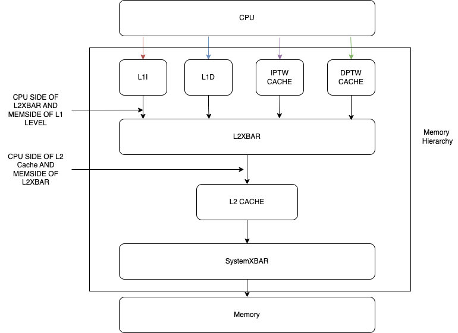
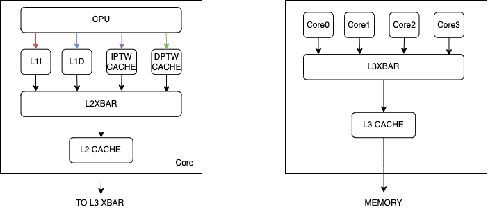

# Modeling Caches & Cache Coherence with GEM5

## Caches in GEM5 

One of main components in GEM5 is a cache hiearchy. The cache hierarchy is a set of caches that are used to store data and instructions that are frequently accessed by the CPU. The cache hierarchy is used to reduce the latency of memory accesses and to reduce the number of memory accesses that are made to the main memory.

Gem5 currently has two distinct subsystems to model on-chip caches: “Classic caches” and “Ruby”. This distinction arises from gem5's origins, combining m5 from Michigan and GEMS from Wisconsin. GEMS used Ruby for cache modeling, while m5 used classic caches. Ruby is designed for detailed cache coherence modeling and includes SLICC, a language for defining cache coherence protocols. In contrast, classic caches use a simplified and inflexible MOESI coherence protocol.

When choosing a model, consider your focus. Use Ruby if you are modeling changes to the cache coherence protocol or if the coherence protocol significantly impacts your results. Otherwise, if the coherence protocol is not a primary concern, use the classic caches.

## Communication between memory elements in GEM5

- **Ports**: Ports in GEM5 enable communication between models by sending and receiving messages. There are two types of ports in GEM5: RequestPort and ResponsePort.
  - **RequestPort**: Sends requests and waits for responses.
  - **ResponsePort**: Waits for requests and sends responses.
  - Both types of ports can carry data with their requests and responses. It is important to distinguish between the request/response mechanism and the data being transferred.
    - Example: Read request for data from memory. The request is sent over the RequestPort, and the data is sent back over the ResponsePort.
    - Example: Write request for data to memory. The request and data is sent over the RequestPort, and the response is sent back over the ResponsePort.
  
- **Packets**: Facilitate communication through ports. They can be either request or response packets. Every packet has the following fields:
  - **Addr**: Address of the memory location being accessed.
  - **Data**: Data associated with the packet (the data that the packet carries).
  - **MemCmd**: Denotes the kind of packet and what it should do. Examples include: `readReq`, `readResp`, `writeReq`, `writeResp`.
  - **RequestorID**: ID for the SimObject that created the request (requestor).

## Crossbars in classical caches

The two types of traffic in the crossbar are memory-mapped packets and snooping packets. Memory-mapped requests travel down the memory hierarchy, with responses returning via the same route but in the opposite direction. Concerning snooping packets, they are broadcast to all caches in the system. We can divide the crossbar into two parts: the request side and the response side. The request side is responsible for sending requests to the memory hierarchy, while the response side is responsible for sending responses back to the requestor.

Two types of crossbars: 
  - CoherentCrossbar: Used for snooping-based cache coherence protocols.
    - **L2XBar**: A coherent crossbar used to connect multiple requestors to the L2 caches.
    - **SystemXBar**: Ties together the CPU clusters, GPUs, any I/O coherent requestors, and DRAM controllers.
  - NoncoherentCrossbar: Does not enforce coherency.

The Python API for the crossbar configuration can be found in [`src/mem/XBar.py`](https://github.com/gem5/gem5/blob/stable/src/mem/XBar.py).

## Building a cache hierarchy in GEM5 - Example

To build a cache hierarchy in GEM5, we need to inherit the 'AbstractClassicCacheHierarchy' class. 

```python
class PrivateL1L2Hierarchy(AbstractClassicCacheHierarchy):
```

Every custom cache hierarchy must implement the following methods:
- ``get_mem_side_ports()`` - Returns the memory side ports.
- ``get_cpu_side_ports()`` - Returns the CPU side ports.
- ``incorporate_cache()`` - Incorporates the cache into the cache hierarchy. This method is called when the cache is created.

### Components:
1. **L1 Caches**:
   - **L1DCache**: Level 1 Data Cache, used for storing data close to the processor.
   - **L1ICache**: Level 1 Instruction Cache, used for storing instructions close to the processor.

2. **L2 Cache**:
   - **L2Cache**: Level 2 Cache, larger than L1 caches and used to store both data and instructions.

3. **MMU Caches**:
   - **MMUCache**: Memory Management Unit caches for instruction and data page table walks.

4. **L2XBar**: A coherent crossbar used to connect multiple requestors to the L2 caches.

4. **SystemXBar**:
   - **SystemXBar**: A high-bandwidth system crossbar that connects different components of the memory system.

### How are the caches connected?

- The the ``cpu_side_ports`` of the L1 caches are connected to processor ports.
- The ``mem_side_ports`` of the L1 caches are connected to the cpu_side_ports of the L2XBAR.

- The ``cpu_side_ports`` of the L2 cache are connected to the mem_side_ports of the L2XBAR.
- The ``mem_side_ports`` of the L2 cache are connected to the cpu_side_ports of the SystemXBar.

- Finally, the ``mem_side_ports`` of the SystemXBar are connected to the memory controller.

- Regarding the Instruction and Data Page Table Walker, they are connected:
  - The ``cpu_side_ports`` of the PTW caches are connected to the processor ports (``core.connect_walker_ports``)
  - The ``mem_side_ports`` of the PTW are connected to the cpu_side_ports of the L2XBar.





## Classic Cache Coherence Modeling

GEM5's classic memory system provides flexible modeling of arbitrary cache hierarchies while abstracting many details of the underlying cache coherence protocol implementation.

- The classic modeling employs the MOESI snooping protocol, where each cache line can exist in one of five states:
    - Modified (M): The cache line is present only in this cache and contains newer data than main memory (dirty). The cache has exclusive ownership and read/write permissions.
    - Owned (O): The cache line is dirty but may exist in multiple caches. This cache holds the most recent, correct copy of the data and is responsible for eventually updating main memory. Only one cache can hold the line in the Owned state, while others may hold it in the Shared state.
    - Exclusive (E): The cache line is present only in this cache and is consistent with main memory (clean). The cache has exclusive ownership with read/write permissions without requiring a bus transaction to modify the line.
    - Shared (S): The cache line may exist in multiple caches and is consistent with main memory. Caches have read-only access in this state.
    - Invalid (I): The cache line is either not present or contains invalid data.


-The medium for snooping is the crossbar, which is responsible for broadcasting the snooping packets to all caches in the system. Suppose a scenario where multiple L1 caches are connected to an L2 cache. Between the L1 and L2 caches, we have a crossbar. 
    
- an L1 miss is broadcasted to the L2 cache via the crossbar, where other L1 caches snoop it.
- if no other cache has the data, the L2 cache fetches it either from the next stage in the hierarchy (L2 miss) or from its cache (L2 hit).

- The crossbar is divided into two parts: the request side and the response side. The request side is responsible for sending requests to the memory hierarchy, while the response side is responsible for sending responses back to the requestor. This corresponds to the traffic of memory-mapped packets. 

- Besides memory-mapped packets, we have snooping packets. 
    - The snooping requests can go horizontally and up the hierarchy (towards memory).
    - The snooping responses can go horizontally and down the hierarchy (towards the CPU).

### Modeling multicore systems with GEM5 

- The cache hierarchy of multicore systems is similar to that of single-core systems, with a few key differences. In a multicore system, each core has its own Level 1 (L1) and Level 2 (L2) caches. At the first level, we find the L1 data cache, the L1 instruction cache, and the Memory Management Unit (MMU) caches, all located within each core. These components are connected to the L2 cache through an L2 crossbar. 

- The L2 cache, in turn, is linked to an L3 crossbar. Each core is connected to the CPU side ports of the L3 crossbar, while the memory side ports of the L3 crossbar are connected to the Level 3 (L3) cache. Finally, the L3 cache is connected to the memory controller. The following figure illustrates the cache hierarchy of a multicore system.




## Literature

- [gem5.org](https://www.gem5.org/)
- [gem5 2024 Bootcamp - Modeling Caches](https://bootcamp.gem5.org/#02-Using-gem5/05-cache-hierarchies)
- [gem5 2024 Bootcamp - Modeling Ports](https://bootcamp.gem5.org/#03-Developing-gem5-models/04-ports)
- YouTube tutorial [link](https://www.youtube.com/watch?v=H6K0hE_zrfY&list=PL_hVbFs_loVR_8ntTTmmG6YEq3Po_4snu&index=8)
- Official documentation [link](https://www.gem5.org/documentation/general_docs/memory_system/classic_caches/)
-  [Classic coherence in GEM5](https://www.gem5.org/documentation/general_docs/memory_system/classic-coherence-protocol/)
-  [MESI and MOESI Protocols](https://developer.arm.com/documentation/den0013/d/Multi-core-processors/Cache-coherency/MESI-and-MOESI-protocols)
- [M5 Ops](https://www.gem5.org/documentation/general_docs/m5ops/)
