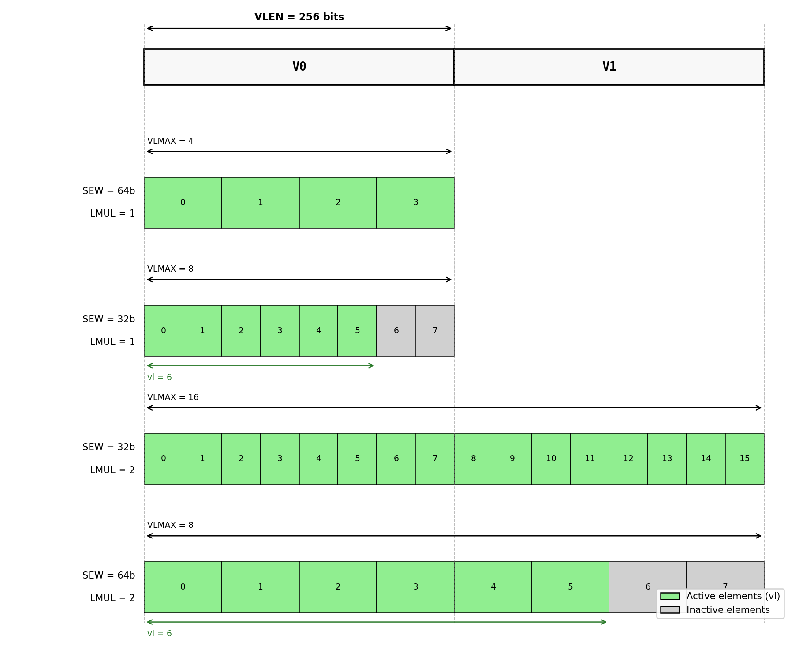

# Risc-v Vector Extension (RVV) and GEM5    

## RISC-V Vector Extension (RVV)

The RVV extension introduces a modern vector architecture designed to serve both high-performance computing and energy-constrained edge platforms. Its instruction set covers arithmetic operations, reductions, permutations, masking, and gather/scatter memory access. Memory instructions support unit-stride, strided, and indexed access patterns, accommodating both regular streaming and irregular data movement. Masking and predication enable conditional execution within a vector register, while permutation instructions address non-contiguous data layouts. Together, these features allow RVV to support dense and sparse linear algebra as well as other computationally intensive workloads within a unified programming model.

The defining feature of RVV is vector-length agnosticism (VLA), which allows a single binary to execute efficiently across processors with different architectural vector lengths. Unlike fixed-width SIMD architectures, RVV exposes only an implementation-dependent maximum vector length (*VLEN*) and configures the effective vector length (*vl*) at run time via the \texttt{vsetvli} instruction. This design enables efficient execution even when the number of active elements is smaller than the maximum register capacity (*VLMAX*). As illustrated below, varying the Standard Element Width (*SEW*) changes the number of elements per register and thus determines *VLMAX*.

RVV additionally supports vector register grouping through the length multiplier (*LMUL*), which combines multiple physical registers into a single logical register. This increases the number of elements processed per instruction at the cost of reducing the number of architecturally visible registers. As also illustrated below, the effective vector length scales proportionally with *LMUL*, allowing kernels to process more elements per instruction than *VLEN* alone would permit.



Some of the processors implementing RVV:
- [Xuante 910](https://ftp.libre-soc.org/466100a052.pdf) (RVV 1.0, VLEN=256 bits)
- [Vitruvius+](https://www.european-processor-initiative.eu/wp-content/uploads/2022/06/Spring_Week-2022_RISCV_Vitruvius_Francesco_Minervini.pdf) (RVV 1.0, VLEN=16K bits)

## Vector programming

RVV instructions operate on chunks of data simultaneously, improving the application's performance. We refer to these chunks as vectors. Unlike AVX, where the vector width is fixed at compile time (e.g. 256 bits for AVX2), RVV does not fix the vector length in the instruction encoding. Instead, the hardware exposes its physical vector register length (*VLEN*) and the programmer configures the effective vector length (*vl*) at run time using the `vsetvli` instruction. For example, on a processor with VLEN=256 bits and SEW=32 bits, a vector register holds eight single-precision floats — the same capacity as one AVX2 register — but the same binary runs correctly and efficiently on a processor with VLEN=512 bits without recompilation.

Let us see how we can improve the following C code using RVV intrinsics:

```c
float A[64], B[64], C[64];
/* ... */
for (int i = 0; i < 64; i++)
    C[i] = A[i] + B[i];
```

Using RVV intrinsics, multiple floating-point values are added in a single iteration, reducing the number of loop iterations required. Unlike the AVX version, the step size is not a compile-time constant — it is determined by `vsetvli` at run time and stored in `vl`:

```c
#include <riscv_vector.h>

float A[64], B[64], C[64];
/* ... */
size_t vl;
for (int i = 0; i < 64; i += vl) {
    /* Configure vl = min(64 - i, VLMAX) for 32-bit floats, m1 grouping */
    vl = __riscv_vsetvl_e32m1(64 - i);

    /* Load vl elements from A and B into vector registers */
    vfloat32m1_t va = __riscv_vle32_v_f32m1(&A[i], vl);
    vfloat32m1_t vb = __riscv_vle32_v_f32m1(&B[i], vl);

    /* Add element-wise */
    vfloat32m1_t vc = __riscv_vfadd_vv_f32m1(va, vb, vl);

    /* Store vl results back to C */
    __riscv_vse32_v_f32m1(&C[i], vc, vl);
}
```

This loop structure is known as **strip-mining**: the iteration space is divided into strips of width `vl`, each processed by a single sequence of vector instructions. Strip-mining reduces loop overhead and improves throughput by replacing multiple scalar operations with a single vector operation per strip.

A key advantage of RVV strip-mining over fixed-width SIMD is that the tail — the remaining elements when the array length is not a multiple of *VLMAX* — is handled automatically. On the last iteration, `vsetvli` returns a smaller `vl` equal to the number of remaining elements, so no separate scalar cleanup loop is needed. For an array of 64 elements on a processor with VLMAX=8, the loop executes exactly eight iterations, each processing eight elements. On a processor with VLMAX=16, the same binary executes four iterations without modification.


## Data types and naming conventions

To begin programming with RVV intrinsics, it is essential to understand the supported data types. Unlike AVX2, where vector types encode a fixed bit-width (e.g. `__m256`), RVV vector types encode the *element type* and the *LMUL grouping*, since the physical vector length *VLEN* is hardware-dependent. The following table summarises the most commonly used RVV vector types:

| Data type | Description |
|---|---|
| `vint8m1_t` | vector of 8-bit signed integers, LMUL=1 |
| `vuint8m1_t` | vector of 8-bit unsigned integers, LMUL=1 |
| `vint16m1_t` | vector of 16-bit signed integers, LMUL=1 |
| `vuint16m1_t` | vector of 16-bit unsigned integers, LMUL=1 |
| `vint32m1_t` | vector of 32-bit signed integers, LMUL=1 |
| `vuint32m1_t` | vector of 32-bit unsigned integers, LMUL=1 |
| `vint64m1_t` | vector of 64-bit signed integers, LMUL=1 |
| `vuint64m1_t` | vector of 64-bit unsigned integers, LMUL=1 |
| `vfloat32m1_t` | vector of 32-bit floats, LMUL=1 |
| `vfloat64m1_t` | vector of 64-bit doubles, LMUL=1 |
| `vbool1_t` | mask vector, 1 bit per element |
| `vbool8_t` | mask vector, 1 bit per 8 elements |

The LMUL suffix (`m1`, `m2`, `m4`, `m8`) controls register grouping. For example, `vfloat32m4_t` groups four physical registers into one logical register, quadrupling the number of elements processed per instruction. Fractional LMUL values (`mf2`, `mf4`, `mf8`) reduce the number of elements, reserving more architectural registers for other uses.

The naming convention for RVV intrinsic functions follows the format:

`__riscv_<name>_<operand_types>_<return_type>`

where the parts stand for:
- `__riscv_` — mandatory prefix for all RVV intrinsics
- `<name>` — describes the operation (e.g. `vle32`, `vfadd`, `vfmacc`, `vsetvl`)
- `<operand_types>` — encodes the types of the input operands using suffixes:
  - `vv` — vector × vector
  - `vf` — vector × scalar float
  - `vx` — vector × scalar integer
  - `vs` — vector × scalar (reduction context)
- `<return_type>` — encodes the output element type and LMUL:
  - `f32m1`, `f64m2`, ... — floating-point with element width and LMUL
  - `i32m1`, `u32m4`, ... — signed/unsigned integer with element width and LMUL

Some examples illustrating the convention:

| Intrinsic | Operation |
|---|---|
| `__riscv_vle32_v_f32m1(ptr, vl)` | unit-stride load → `vfloat32m1_t` |
| `__riscv_vfadd_vv_f32m1(va, vb, vl)` | element-wise float add, vector × vector |
| `__riscv_vfadd_vf_f32m1(va, scalar, vl)` | element-wise float add, vector × scalar |
| `__riscv_vfmacc_vf_f32m1(acc, scalar, vb, vl)` | `acc = scalar * vb + acc` |
| `__riscv_vfredusum_vs_f32m1_f32m1(vs2, vs1, vl)` | ordered reduction to scalar |
| `__riscv_vse32_v_f32m1(ptr, vs3, vl)` | unit-stride store |
| `__riscv_vsetvl_e32m1(n)` | set `vl` for SEW=32, LMUL=1 |

Note that every intrinsic taking a vector operand also takes `vl` as its final argument. This makes the active element count explicit at every operation, which is a fundamental difference from AVX2 where all lanes are always active.

## RVV instruction overview

With the vector unit configured via `vsetvli`, the programmer can issue vector instructions across three broad categories: arithmetic, memory access, and permutation. All instructions implicitly operate on exactly `vl` elements as set by the most recent `vsetvli` call.

---

### Arithmetic instructions

RVV provides arithmetic instructions for both integer and floating-point operands. The operand encoding suffix indicates whether the second operand is a vector (`vv`), a scalar register (`vx` for integer, `vf` for float), or an immediate (`vi`).

#### Integer arithmetic

| Intrinsic | Operation |
|---|---|
| `__riscv_vadd_vv_i32m1(va, vb, vl)` | element-wise add: `va[i] + vb[i]` |
| `__riscv_vadd_vx_i32m1(va, scalar, vl)` | add scalar to each element |
| `__riscv_vsub_vv_i32m1(va, vb, vl)` | element-wise subtract |
| `__riscv_vmul_vv_i32m1(va, vb, vl)` | element-wise multiply (low half) |
| `__riscv_vsll_vx_u32m1(va, shift, vl)` | logical left shift by scalar |
| `__riscv_vand_vv_u32m1(va, vb, vl)` | bitwise AND |
| `__riscv_vredsum_vs_i32m1_i32m1(vs2, vs1, vl)` | reduction: sum into scalar |

**Example — integer dot product accumulation:**

```c
/* Accumulate element-wise products into a scalar sum */
vint32m1_t vzero = __riscv_vmv_v_x_i32m1(0, 1);
vint32m4_t vacc  = __riscv_vmv_v_x_i32m4(0, __riscv_vsetvlmax_e32m4());
size_t vl;

for (size_t i = 0; i < n; i += vl) {
    vl = __riscv_vsetvl_e32m4(n - i);
    vint32m4_t va = __riscv_vle32_v_i32m4(A + i, vl);
    vint32m4_t vb = __riscv_vle32_v_i32m4(B + i, vl);
    vacc = __riscv_vmacc_vv_i32m4(vacc, va, vb, vl); /* acc += a * b */
}
/* Reduce vector accumulator to a single scalar */
vint32m1_t vsum = __riscv_vredsum_vs_i32m4_i32m1(vacc, vzero,
                      __riscv_vsetvlmax_e32m4());
int32_t result = __riscv_vmv_x_s_i32m1_i32(vsum);
```

#### Floating-point arithmetic

| Intrinsic | Operation |
|---|---|
| `__riscv_vfadd_vv_f32m1(va, vb, vl)` | element-wise float add |
| `__riscv_vfsub_vv_f32m1(va, vb, vl)` | element-wise float subtract |
| `__riscv_vfmul_vv_f32m1(va, vb, vl)` | element-wise float multiply |
| `__riscv_vfmacc_vf_f32m1(acc, scalar, vb, vl)` | fused: `acc = scalar * vb + acc` |
| `__riscv_vfmadd_vv_f32m1(va, vb, vc, vl)` | fused: `va = va * vb + vc` |
| `__riscv_vfredusum_vs_f32m1_f32m1(vs2, vs1, vl)` | ordered float reduction to scalar |

**Example — AXPY (`y = α·x + y`):**

```c
size_t vl;
for (size_t i = 0; i < n; i += vl) {
    vl = __riscv_vsetvl_e32m1(n - i);
    vfloat32m1_t vx = __riscv_vle32_v_f32m1(x + i, vl);
    vfloat32m1_t vy = __riscv_vle32_v_f32m1(y + i, vl);
    vy = __riscv_vfmacc_vf_f32m1(vy, alpha, vx, vl); /* vy = alpha*vx + vy */
    __riscv_vse32_v_f32m1(y + i, vy, vl);
}
```

---

### Memory access instructions

RVV supports three memory access patterns. All share the same load/store naming structure: `vle<sew>` / `vse<sew>` for unit-stride, `vlse<sew>` / `vsse<sew>` for strided, and `vloxei<sew>` / `vsoxei<sew>` for indexed (gather/scatter).

#### Unit-stride

The simplest pattern: elements are read or written at consecutive memory addresses. This achieves the highest memory bandwidth and is the default choice when data is contiguous.

| Intrinsic | Operation |
|---|---|
| `__riscv_vle32_v_f32m1(ptr, vl)` | load `vl` consecutive f32 elements |
| `__riscv_vse32_v_f32m1(ptr, vs, vl)` | store `vl` consecutive f32 elements |

```c
/* Copy n floats from src to dst */
size_t vl;
for (size_t i = 0; i < n; i += vl) {
    vl = __riscv_vsetvl_e32m4(n - i);
    vfloat32m4_t v = __riscv_vle32_v_f32m4(src + i, vl);
    __riscv_vse32_v_f32m4(dst + i, v, vl);
}
```

#### Strided

Elements are separated by a constant byte stride. Useful for accessing a single column of a row-major matrix or interleaved data structures.

| Intrinsic | Operation |
|---|---|
| `__riscv_vlse32_v_f32m1(ptr, stride, vl)` | load with byte stride |
| `__riscv_vsse32_v_f32m1(ptr, stride, vs, vl)` | store with byte stride |

```c
/* Load one column of a row-major matrix A[M][N] */
ptrdiff_t col_stride = N * sizeof(float);   /* bytes between rows */
size_t vl;
for (size_t i = 0; i < M; i += vl) {
    vl = __riscv_vsetvl_e32m2(M - i);
    /* A[i][col], A[i+1][col], ..., A[i+vl-1][col] */
    vfloat32m2_t vcol = __riscv_vlse32_v_f32m2(
                            &A[i * N + col], col_stride, vl);
    __riscv_vse32_v_f32m2(out + i, vcol, vl);
}
```

#### Indexed (gather / scatter)

Element addresses are computed from a base pointer plus a vector of byte offsets. This supports fully irregular access patterns such as SpMV, graph traversal, or lookup tables.

| Intrinsic | Operation |
|---|---|
| `__riscv_vloxei32_v_f32m1(base, offsets, vl)` | gather: load `base[offsets[i]]` |
| `__riscv_vsoxei32_v_f32m1(base, offsets, vs, vl)` | scatter: store to `base[offsets[i]]` |

```c
/* Gather x[col_idx[j..j+vl-1]] — inner loop of SpMV CSR */
size_t vl;
for (int j = row_start; j < row_end; j += (int)vl) {
    vl = __riscv_vsetvl_e32m2(row_end - j);

    /* Load column indices and convert to byte offsets */
    vuint32m2_t vidx = __riscv_vle32_v_u32m2(
                           (uint32_t *)(col_idx + j), vl);
    vuint32m2_t voff = __riscv_vsll_vx_u32m2(vidx, 2, vl); /* ×4 bytes */

    /* Gather values from x */
    vfloat32m2_t vx = __riscv_vloxei32_v_f32m2(x, voff, vl);

    /* Load matrix values and accumulate */
    vfloat32m2_t vv = __riscv_vle32_v_f32m2(val + j, vl);
    vacc = __riscv_vfmacc_vv_f32m2(vacc, vv, vx, vl);
}
```

The three patterns and their typical use cases are summarised below:

| Pattern | Instruction | Access regularity | Typical use case |
|---|---|---|---|
| Unit-stride | `vle`/`vse` | fully regular | array copy, AXPY, dense GEMV |
| Strided | `vlse`/`vsse` | regular, fixed gap | matrix column, interleaved data |
| Indexed | `vloxei`/`vsoxei` | irregular | SpMV, graph algorithms, LUT lookup |

---

### Permutation instructions

Permutation instructions rearrange elements within or across vector registers without involving memory. They are essential for implementing reductions, sliding-window algorithms, and data format conversions.

#### Slide — `vslidedown` / `vslideup`

Slide instructions shift elements within a vector register by a scalar offset. `vslidedown` shifts elements towards lower indices (discarding the bottom), while `vslideup` shifts towards higher indices (discarding the top).

| Intrinsic | Operation |
|---|---|
| `__riscv_vslidedown_vx_f32m1(vs, offset, vl)` | `dst[i] = src[i + offset]` |
| `__riscv_vslideup_vx_f32m1(vd, vs, offset, vl)` | `dst[i + offset] = src[i]` |

```c
/* Shift a vector right by 1 to compute pairwise differences:
   delta[i] = x[i+1] - x[i]  */
size_t vl;
for (size_t i = 0; i < n - 1; i += vl) {
    vl = __riscv_vsetvl_e32m1(n - 1 - i);
    vfloat32m1_t vcur  = __riscv_vle32_v_f32m1(x + i,     vl);
    vfloat32m1_t vnext = __riscv_vle32_v_f32m1(x + i + 1, vl);
    vfloat32m1_t vdiff = __riscv_vfsub_vv_f32m1(vnext, vcur, vl);
    __riscv_vse32_v_f32m1(delta + i, vdiff, vl);
}
```

#### Gather — `vrgather`

`vrgather` performs an intra-register gather: each output element is selected from an arbitrary position within the source register, with the position given by a second index vector. This makes it possible to implement arbitrary element permutations, table lookups within a register, and broadcast of a single element.

| Intrinsic | Operation |
|---|---|
| `__riscv_vrgather_vv_f32m1(vs, idx, vl)` | `dst[i] = src[idx[i]]` |
| `__riscv_vrgather_vx_f32m1(vs, scalar_idx, vl)` | broadcast: `dst[i] = src[scalar_idx]` |

```c
/* Reverse a short vector using vrgather with a precomputed index vector:
   dst[i] = src[vl - 1 - i]  */
vl = __riscv_vsetvl_e32m1(n);

/* Build the reverse index vector [n-1, n-2, ..., 0] */
vuint32m1_t vseq = __riscv_vid_v_u32m1(vl);            /* [0, 1, ..., vl-1] */
vuint32m1_t vrev = __riscv_vrsub_vx_u32m1(vseq, vl - 1, vl); /* [vl-1, ..., 0] */

vfloat32m1_t vsrc = __riscv_vle32_v_f32m1(src, vl);
vfloat32m1_t vdst = __riscv_vrgather_vv_f32m1(vsrc, vrev, vl);
__riscv_vse32_v_f32m1(dst, vdst, vl);
```

The two permutation instructions and their capabilities are summarised below:

| Instruction | Index source | Typical use case |
|---|---|---|
| `vslidedown`/`vslideup` | scalar offset | sliding windows, stencils, neighbour differences |
| `vrgather` (vector index) | index vector | arbitrary permutation, data reordering |
| `vrgather` (scalar index) | scalar constant | broadcast one element to all lanes |

## Implicit (overloaded) intrinsic naming

The explicit naming scheme described in the previous section produces intrinsic names that are fully self-describing but verbose. For example, a simple element-wise float addition requires writing:
```c
vfloat32m1_t vc = __riscv_vfadd_vv_f32m1(va, vb, vl);
```

To reduce this verbosity, the RVV C intrinsic specification defines an *overloaded* (implicit) naming scheme. Under this scheme the return type suffix and, where unambiguous, the operand suffix are omitted from the intrinsic name. The compiler infers the missing information from the types of the arguments passed to the call.

The overloaded form of the same addition is:
```c
vfloat32m1_t vc = __riscv_vfadd(va, vb, vl);
```

The compiler sees that `va` and `vb` are both `vfloat32m1_t`, deduces that the operation is `vv` (vector × vector) on `f32m1` elements, and selects the correct instruction accordingly.

---

### How overloading is resolved

The C and C++ compilers resolve the overloaded name using the types of the function arguments, applying the following rules in order:

1. **Return type** is inferred from the type of the first vector source operand. If the return type differs from the input type (widening, narrowing, or reduction), both types must still be inferable from the argument list.
2. **Operand suffix** (`vv`, `vx`, `vf`, `vi`) is inferred from the type of the second operand:
   - another vector type → `vv`
   - a `float` or `double` scalar → `vf`
   - an integer scalar → `vx`
   - a compile-time constant → `vi` (where supported)
3. **`vl`** is always the final argument and is always explicit; it is never omitted.

---

### Explicit vs. overloaded names

The table below shows explicit and overloaded forms side by side for a representative set of intrinsics:

| Explicit name | Overloaded name | Operation |
|---|---|---|
| `__riscv_vfadd_vv_f32m1(va, vb, vl)` | `__riscv_vfadd(va, vb, vl)` | f32 vector + vector |
| `__riscv_vfadd_vf_f32m1(va, s, vl)` | `__riscv_vfadd(va, s, vl)` | f32 vector + scalar |
| `__riscv_vadd_vv_i32m2(va, vb, vl)` | `__riscv_vadd(va, vb, vl)` | i32 vector + vector |
| `__riscv_vadd_vx_i32m2(va, x, vl)` | `__riscv_vadd(va, x, vl)` | i32 vector + scalar |
| `__riscv_vfmacc_vf_f32m1(acc, s, vb, vl)` | `__riscv_vfmacc(acc, s, vb, vl)` | fused multiply-accumulate |
| `__riscv_vle32_v_f32m1(ptr, vl)` | `__riscv_vle32(ptr, vl)` | unit-stride f32 load |
| `__riscv_vse32_v_f32m1(ptr, v, vl)` | `__riscv_vse32(ptr, v, vl)` | unit-stride f32 store |
| `__riscv_vrgather_vv_f32m1(vs, idx, vl)` | `__riscv_vrgather(vs, idx, vl)` | intra-register gather |
| `__riscv_vslidedown_vx_f32m1(vs, off, vl)` | `__riscv_vslidedown(vs, off, vl)` | slide toward index 0 |

For memory instructions, the element width remains in the base name (`vle32`, `vse32`) because it determines the hardware access size and cannot be inferred from a pointer type alone.

---

### Practical example

The explicit AXPY kernel from the previous section can be rewritten using overloaded intrinsics:
```c
/* Explicit form */
size_t vl;
for (size_t i = 0; i < n; i += vl) {
    vl = __riscv_vsetvl_e32m1(n - i);
    vfloat32m1_t vx = __riscv_vle32_v_f32m1(x + i, vl);
    vfloat32m1_t vy = __riscv_vle32_v_f32m1(y + i, vl);
    vy = __riscv_vfmacc_vf_f32m1(vy, alpha, vx, vl);
    __riscv_vse32_v_f32m1(y + i, vy, vl);
}

/* Overloaded form — functionally identical */
for (size_t i = 0; i < n; i += vl) {
    vl = __riscv_vsetvl_e32m1(n - i);
    vfloat32m1_t vx = __riscv_vle32(x + i, vl);
    vfloat32m1_t vy = __riscv_vle32(y + i, vl);
    vy = __riscv_vfmacc(vy, alpha, vx, vl);
    __riscv_vse32(y + i, vy, vl);
}
```

Both forms compile to identical machine code. The choice between them is purely a matter of readability preference.

---
